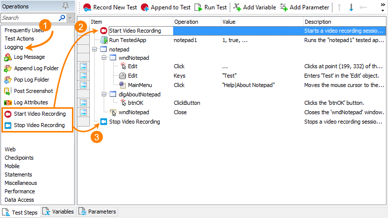
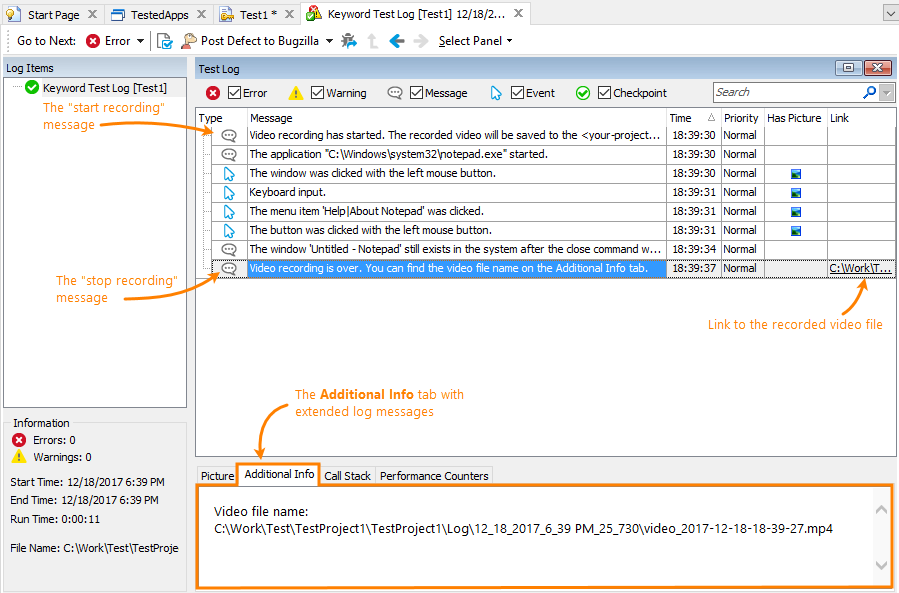

VideoRecorder Extension for TestComplete
=================

This extension enables you to record videos for your automated tests running in SmartBear [TestComplete](https://smartbear.com/product/testcomplete/overview/) or [TestExecute](https://smartbear.com/product/testexecute/overview/").
The extension adds the `VideoRecorder` script object for starting and stopping video recording from your script tests, and the **Start** and **Stop Video Recording** keyword-test operations for doing this from keyword tests.
The extension uses JScript sources, but it is suitable for any supported scripting language.

# Why VideoRecorder?

It records a video for your test runs, helping you to check the test execution and to understand what happened in your system and in the tested application during the test run.

VideoRecorder is similar to [Test Visualizer](https://support.smartbear.com/testcomplete/docs/testing-with/visualizer/about.html) of TestComplete, but it provides more convenient results. While Test Visualizer captures images for test commands that simulate user actions, VideoRecorder creates a movie reflecting all the events, including those that occur between two commands. Also, it is easier to analyze a seamless video clip than a series of screenshots.

# When to Use
Use VideoRecorder when it is difficult to understand the cause of an issue during automated test runs. For example, in some cases, it is really difficult to find the cause of issues that occur during nightly test runs. Videos can help you with this.

Note that videos can occupy a lot of space on your hard drive. Also, long videos may be inconvenient for analysis in comparison with short video clips. That is why we do not recommend that you record a video for the entire nightly test run. Do this for problematic areas only. You can easily achieve this by adding the **Start** and **Stop Video Recording** commands to the appropriate places in your tests (see [below](#using-video-recorder)).

# Video Recorder Engine
The extension uses the recording functionality of the free, open-source VLC media player by VideoLAN.
You can download it from **[https://www.videolan.org/](https://www.videolan.org/)**.

# Installation

### 1. Install the VLC Media Player
1. Download the VLC installer from **[https://www.videolan.org/](https://www.videolan.org/)**.
2. Install the VLC media player on your computer. The installation is straight-forward. Just follow the instructions of the installation wizard.

### 2. Get the Extension
1. Clone the repository to your computer.
2. Open the command-line window and run the _`build.bat`_ file located in the repository root folder. 
It will pack the extension sources to the _`VideoRecorder.tcx`_ archive and copy the archive to the _`out`_ subfolder of your repo.

### 3. Install the Extension
1. Close TestComplete (or TestExecute). 
2. Copy the file VideoRecorder.tcx from the _`out`_ subfolder to the _`Bin\Extensions\ScriptExtensions\`_ folder of your TestComplete or TestExecute installation, for example:
  - TestComplete:
        `C:\Program Files (x86)\SmartBear\TestComplete 12\Bin\Extensions\ScriptExtensions`
  - TestExecute:
        `C:\Program Files (x86)\SmartBear\TestExecute 12\Bin\Extensions\ScriptExtensions`

Now you can launch the product and use the extension as you want.

<a name="using-video-recorder"></a>
# Using Video Recorder

You can start and stop recording from your script or keyword tests.

### In Keyword Tests

To start and stop recording, you use the **Start Video Recording** and **Stop Video Recording** operations which VideoRecorder adds to TestComplete. You can find these operations in the **Logging** operation category. Simply drag these operations to your test:

  

That's all. Now you can run your test. 


### In Scripts
To work with the recorder from scripts, the extension adds the `VideoRecorder` object to TestComplete. The object is available in all the supported scripting languages. 

Use the `VideoRecorder.Start()` method to start recording, and `VideoRecorder.Stop()` to stop it. The `Start()` method has the _VideoQuality_ string parameter (`Start(VideoQuality)`) that specifies the quality of the recorded video. Possible values include "_Low_", "_Normal_" (default) and "_High_". The parameter is case-insensitive.

```JavaScript
// JavaScript example

function foo() {
  // Start recording with High quality
  VideoRecorder.Start("High")
  
  // Do some test actions
  WshShell.Run("notepad");
  var pNotepad = Sys.WaitProcess("notepad", 10*1000);
  var wMain = pNotepad.Window("Notepad", "*Notepad")
  var wEdit = wMain.Window("Edit")
  wEdit.Keys("Test")
  wMain.MainMenu.Click("Help|About Notepad");
  pNotepad.Window("#32770", "About Notepad").Window("Button", "OK").ClickButton();
  pNotepad.Close()
  
  // Stop recording
  VideoRecorder.Stop()
}
```

To determine if the recorder is working, use the `VideoRecorder().IsRecording()` method.


# Results
During its work, the recorder posts informative, warning and error messages to the test log.

Information on the recorded file name is available in the test log in both the "start" and "stop" messages. You can find the file name on the Additional Info tab:



The link to the recorded video is posted along with the "stop" message. The "start" message does not contain it, because the file does not exist at the moment of the start.

The recorder generates the video file when the recording stops or when TestComplete exits. If your test stops on error, then it is possible the execution flow will not reach the "stop" command and it will not be executed. For more information on this issue and for possible workarounds, see [below](#if-stop-on-error).

# Notes
- The recorder always captures the entire screen.
- On systems with multiple display devices, it records the main display only.
- The video format is `.mp4`.
- The size of the resulting movie depends on how long the video was recorded, on its quality (low, normal, or high) and on your screen resolution.
- The video file name includes the date and time of the start of video recording, so you can record several videos during one test run.
- If generation of the resulting video file takes longer than 10 minutes, the extension cancels this process, stops the recording engine and reports an error.
- The keyword-test operations and the `Start` and `Stop` scripting methods return the fully-qualified name of the recorded video file.
- **IMPORTANT:** start and stop recording from within your test. The extension cannot use the recorder instance started outside TestComplete (or outside TestExecute). 
  Also, it is **_very important_** to stop the recorder when the testing is over. The extension cannot start recording if you have a working recorder instance in the system. In this case, you have to close the recorder process (or processes) manually. 
  
<a name="if-stop-on-error"></a>
# If Your Test Stops on Error

This can happen rather frequently. For example, if the _[Stop on Error](https://support.smartbear.com/testcomplete/docs/working-with/managing-projects/properties/playback.html)_ property of your project is enabled, the test engine stops the test run once an error is posted to the log. In this case, it is possible the recorder will not be stopped because the test will not reach the "Stop" command.

Possible workarounds:
- Consider adding another "Stop Video Recording" command to the [`OnStopTest`](https://support.smartbear.com/testcomplete/docs/reference/events/onstoptest.html) event handler. That is, you will have two "Stop" commands: one in the place where you need to stop recording, and another in the OnStopTest event handler. This event is raised whenever the test execution stops, so placing the "Stop" command there can be a good idea. Note that it is important to check if the recorder is running before calling `Stop()`:
  ```JavaScript
  // JavaScript example
  function GeneralEvents_OnStopTest(Sender)
  {
    if (VideoRecorder.IsRecording()) // Check if the recorder is working
      VideoRecorder.Stop();
  }
  ```

- Consider adding the _`/exit`_  (or _`/e`_) argument to the TestComplete (or TestExecute) [command line](https://support.smartbear.com/testcomplete/docs/working-with/automating/command-line-and-exit-codes/command-line.html). In this case, when the test stops on error, the test engine will close TestComplete (TestExecute). The extension will detect this and will generate a video file. To find the file name, check the Additional Info posted to the log along with the "start" log message.

- Consider disabling the _Stop on Error_ project property. See [Project Properties - Playback Options](https://support.smartbear.com/testcomplete/docs/working-with/managing-projects/properties/playback.html) in TestComplete documentation. 


# Supported Versions
We have tested the extension on -- 
 * TestComplete 12.40
 * VLC media player 2.2.6

Most likely, the extension will work with other TestComplete and VLC versions.

# Contacts and Feedback
To learn more about the extension, please visit the **[TestComplete Community](https://community.smartbear.com/t5/TestComplete/ct-p/TestComplete_forum)** forum.

Do not hesitate to send your questions, comments, bug reports and suggestions to the forum. We appreciate any feedback. 

If you want to improve or fix code, feel free to send pull requests to this repo.

